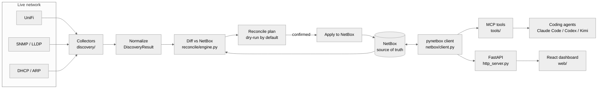

# Argus Architecture

Argus is one product with two deployables in a monorepo: a Python **server** (MCP +
FastAPI) and a React **web** dashboard. Its purpose is to keep **NetBox** — the single
source of truth (SoT) — continuously reflecting the network's *actual current state*.

## The core loop

**NetBox is authoritative.** Argus never invents truth; it observes reality and makes
NetBox match. Discovery is *read-only* against the network; the only writes Argus makes
are into NetBox, via the reconciliation engine.

## Layers (server)

| Layer | Module | Responsibility |
| --- | --- | --- |
| Config | `argus/config.py` | Resolve `NETBOX_URL`, `NETBOX_TOKEN`, HTTP host/port from env (`pydantic-settings`). |
| NetBox client | `argus/netbox/client.py` | Typed-ish `pynetbox` wrapper returning plain dicts (DCIM / IPAM). |
| Discovery | `argus/discovery/` | `Collector` interface + **vendor packs** (host/plugin): built-in + entry-point-discovered packs that observe live state. See [ADR-0005](architecture/adr/0005-vendor-packs.md). |
| Reconciliation | `argus/reconcile/engine.py` | Diff observed state vs NetBox → `ReconcilePlan` (dry-run) → apply. |
| Confirmations | `argus/confirmations.py` | Short-TTL store gating any state-changing action. |
| Tools | `argus/tools/` | The agent-facing surface: read, discovery, reconcile. |
| Transports | `argus/server.py`, `argus/http_server.py` | MCP over stdio; FastAPI for the web app + webhooks. |
| Devtools | `argus/devtools/` | Manifest-driven repo maintenance (`argus-release`): version bump + CHANGELOG cut + verify. Not part of the product surface. |

## Discovery: vendor packs (host/plugin)

Discovery is a **host/plugin** layer ([ADR-0005](architecture/adr/0005-vendor-packs.md)).
Each vendor/technology is a `VendorPack` bundling a read-only `Collector` with declarative
metadata (manufacturer, transport, capabilities, the config vars it consumes) and
model→role normalization. The registry (`discovery/vendors/`) merges:

- **built-in packs** shipped in this repo — currently **UniFi** (`discovery/vendors/unifi/`); and
- **external packs** from any installed distribution that advertises an `argus.vendor_packs`
  entry point.

So a pack can live out-of-tree and ship independently — public or private — without changes
to Argus, and the legacy `COLLECTORS` map is derived from the merged set (name lookup
unchanged). Whatever the source or transport, every pack emits the same normalized
`DiscoveryResult`, so the reconcile engine stays vendor-agnostic. Build a pack from the
[`argus-vendor-pack-template`](https://github.com/freed-dev-llc/argus-vendor-pack-template).

## Two transports, one tool set

- **MCP (`argus-mcp`)** — `FastMCP("argus")` over stdio, for coding agents. Registered in
  `.mcp.json`.
- **HTTP (`argus-http`)** — FastAPI on `:8080` for the React app and for NetBox webhooks
  (`POST /webhooks/netbox`). CORS is open to the Vite dev server.

Both call the same underlying tool functions, so behavior can't drift between them.

## Safety model

1. **Dry-run by default.** `ReconcileEngine.diff()` produces a plan; nothing is written
   until `apply()` is called with `confirm=True`.
2. **Confirmation-gated.** `reconcile_apply` first returns a `confirmation_required`
   token; a second, explicit call with that token performs the change. An agent cannot
   silently mutate the SoT.
3. **Least-privilege token.** Start with a read-only NetBox token; widen only when
   reconciliation writes are trusted.

> **Scope note.** Read-only-against-the-network is the *current-phase* stance, not a permanent
> constraint. **Active device management** (writing config back to the network, e.g. via vendor
> packs) is a planned future direction; it will be dry-run + confirmation-gated like reconcile.

## Current status

Implemented and validated end-to-end against a live UniFi network + NetBox 4.6: the UniFi
collector discovers devices, clients, and uplink **topology**; the reconcile engine diffs and
(on confirmation) **persists** to NetBox DCIM + IPAM, resolving/creating the needed foreign
keys; the dashboard surfaces devices, the IPAM prefix tree, drift→apply, and the topology map;
Ansible consumes NetBox via `nb_inventory`. The generic SNMP/LLDP collector is implemented but
unvalidated against live SNMP.

Discovery is now a vendor-pack host/plugin layer ([ADR-0005](architecture/adr/0005-vendor-packs.md));
UniFi ships as the in-tree pack and external/private packs attach via an entry point. Releases
are cut by the manifest-driven `argus-release` devtool. Latest release: **0.1.5** (PyPI
`argus-netbox`, GHCR images). See [ROADMAP.md](ROADMAP.md), [TODO.md](../TODO.md), and the ADRs.
